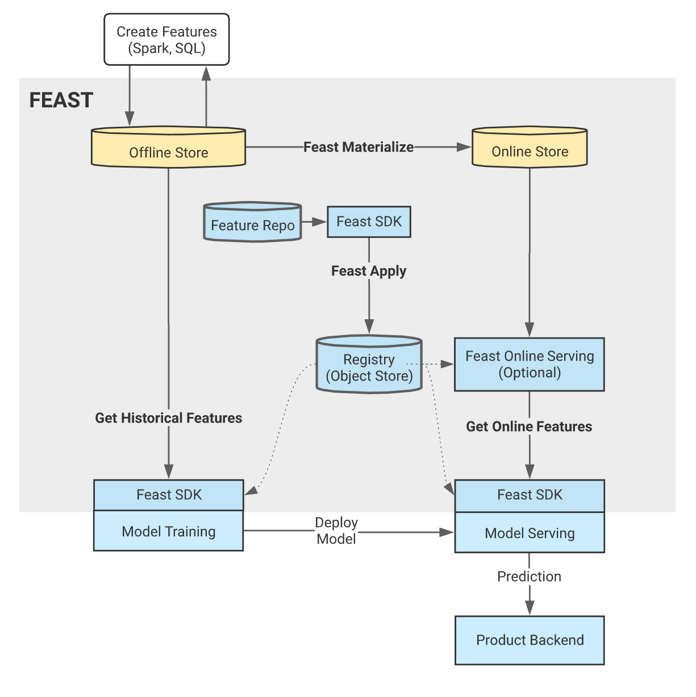

# Basics of Feature Store

Feature stores are systems that help to address some of the key challenges that ML teams face when productionizing features.

Tecton who is  the Primary Contributor to Feast exhibits straightforwardly and neatly comprehensive diagram describing Feature Store. However they only support a version working on AWS as of Sep. 3rd 2021. This affected my decision to test Feast since our working environment is Google cloud working with Bigquery.

 
* **Feature sharing and reuse**: Engineering features is one of the most time consuming activities in building an end-to-end ML system, yet many teams continue to develop features in silos. This leads to a high amount of re-development and duplication of work across teams and projects.
* **Serving features at scale**: Models need data that can come from a variety of sources, including event streams, data lakes, warehouses, or notebooks. ML teams need to be able to store and serve all these data sources to their models in a performant and reliable way. The challenge is scalably producing massive datasets of features for model training, and providing access to real-time feature data at low latency and high throughput in serving.
* **Consistency between training and serving**: The separation between data scientists and engineering teams often lead to the re-development of feature transformations when moving from training to online serving. Inconsistencies that arise due to discrepancies between training and serving implementations frequently leads to a drop in model performance in production.
* **Point-in-time correctness**: General purpose data systems are not built with ML use cases in mind and by extension don’t provide point-in-time correct lookups of feature data. Without a point-in-time correct view of data, models are trained on datasets that are not representative of what is found in production, leading to a drop in accuracy.
* **Data quality and validation**: Features are business critical inputs to ML systems. Teams need to be confident in the quality of data that is served in production and need to be able to react when there is any drift in the underlying data.

 
There are many feature stores in the market which is rising fast. Even if some are integrated with not only feature store but also a few functions in MLOps, Our decision to research on Feast has been caused by its simplicity and compatibility with Google Cloud Platform. Considering fast growing technologies in MLOps industry, working well with existing solutions and services we are already adopted is most important criteria. Imagine that a heavy platform has a feature store competible with their own solutions in the process of MLOps which are not relevent to our system, this is not a good strategy.
[Feast](http://feast.dev/) is an [open-source](https://github.com/feast-dev/feast) feature store that helps teams operate ML systems at scale by allowing them to define, manage, validate, and serve features to models in production.

 
 

# Architecture of Feast

Feast comprise of eight functionalities and five components. Although Feast official document introduce the four components, IMHO, there are Five of them we should take it as components. Cylider shpaes and some of rectangles are components and edges represent functionalities.

 
## Components

1. **Feast Feature Repository** : The feature repository is the declarative source of truth for what the desired state of a feature store should be. Two important sets of configuration are store in this repository and feast handle them. More details can be found if you follow the link [https://docs.feast.dev/reference/feature-repository](https://docs.feast.dev/reference/feature-repository)
    * Configuration about how to run Feast on your infrastructure
    * Feature definitions
2. **Feast Registry**: An object store (GCS, S3) based registry used to persist feature definitions that are registered with the feature store. Systems can discover feature data by interacting with the registry through the Feast SDK.
3. **Feast Python SDK/CLI:** The primary user facing SDK. Used to:
    * Manage version controlled feature definitions.
    * Materialize (load) feature values into the online store.
    * Build and retrieve training datasets from the offline store.
    * Retrieve online features.
4. **Online Store**: The online store is a database that stores only the latest feature values for each entity. The online store is populated by materialization jobs.
5. **Offline Store**: The offline store persists batch data that has been ingested into Feast. This data is used for producing training datasets. Feast does not manage the offline store directly, but runs queries against it.

## Functionalities

1. **Create Batch Features**: ELT/ETL systems like Spark and SQL are used to transform data in the batch store.
2. **Feast Apply**: The user (or CI) publishes versioned controlled feature definitions using feast apply. This CLI command updates infrastructure and persists definitions in the object store registry.
3. **Feast Materialize**: The user (or scheduler) executes feast materialize which loads features from the offline store into the online store.
4. **Model Training**: A model training pipeline is launched. It uses the Feast Python SDK to retrieve a training dataset and trains a model.
5. **Get Historical Features**: Feast exports a point-in-time correct training dataset based on the list of features and entity dataframe provided by the model training pipeline.
6. **Deploy Model**: The trained model binary (and list of features) are deployed into a model serving system. This step is not executed by Feast.
7. **Prediction**: A backend system makes a request for a prediction from the model serving service.
8. **Get Online Features**: The model serving service makes a request to the Feast Online Serving service for online features using a Feast SDK.

 

## Features of Feast

* **Load streaming and batch data**: Feast is built to be able to ingest data from a variety of bounded or unbounded sources. Feast allows users to ingest data from streams, object stores, databases, or notebooks. Data that is ingested into Feast is persisted in both online store and historical stores, which in turn is used for the creation of training datasets and serving features to online systems.
* **Standardized definitions**: Feast becomes the single source of truth for all feature definitions and data within an organization. Teams are able to capture documentation, metadata, and metrics about features. This allows teams to communicate clearly about features, test feature data, and determine if a feature is both safe and relevant to their use cases.
* **Historical serving**: Features that are persisted in Feast can be retrieved through its feature serving APIs to produce training datasets. Feast is able to produce massive training datasets that are agnostics of the data source that was used to ingest the data originally. Feast is also able to ensure point-in-time correctness when joining these data sources, which in turn ensures the quality and consistency of features reaching models.
* **Online serving**: Feast exposes low latency serving APIs for all data that has been ingested into the system. This allows all production ML systems to use Feast as the primary data source when looking up real-time features.
* **Consistency between training and serving**: Feast provides a consistent view of feature data through the use of a unified ingestion layer, unified serving API and canonical feature references. By building ML systems on feature references, teams abstract away the underlying data infrastructure and make it possible to safely move models between training and serving without a drop in data consistency.
* **Feature sharing and reuse**: Feast provides a discovery and metadata API that allows teams to track, share, and reuse features across projects. Feast also decouples the process of creating features from the process of consumption, meaning teams that start new projects can begin by simply consuming features that already exist in the store, instead of starting from scratch.
* **Statistics and validation**: Feast allows for the generation of statistics based on features within the systems. Feast has compatibility with TFDV, meaning statistics that are generated by Feast can be validated using TFDV. Feast also allows teams to capture TFDV schemas as part of feature definitions, allowing domain experts to define data properties that can be used for validating these features in other production settings like training, ingestion, or serving.

 

## APIs of Feast

Feast APIs can roughly be grouped into the following sections:

* **Feature definition and management**: Feast provides both a [Python SDK](https://docs.feast.dev/quickstart) and [CLI](https://docs.feast.dev/quickstart) for interacting with Feast Core. Feast Core allows users to define and register features and entities and their associated metadata and schemas. The Python SDK is typically used from within a Jupyter notebook by end users to administer Feast, but ML teams may opt to version control feature specifications in order to follow a GitOps based approach.
* **Model training**: The Feast Python SDK can be used to trigger the [creation of training datasets](https://docs.feast.dev/feast-on-kubernetes/user-guide/getting-training-features). The most natural place to use this SDK is to create a training dataset as part of a [Kubeflow Pipeline](https://www.kubeflow.org/docs/components/pipelines/overview/pipelines-overview) prior to model training.
* **Model serving**: Feast provides three different SDKs for [online feature serving](https://docs.feast.dev/feast-on-kubernetes/user-guide/getting-online-features), a [Python SDK](https://api.docs.feast.dev/python/), [Java SDK](https://javadoc.io/doc/dev.feast/feast-sdk), and [Go SDK](https://godoc.org/github.com/feast-dev/feast/sdk/go). These clients are used prior to inference with [Model Serving](https://www.kubeflow.org/docs/components/pipelines/overview/pipelines-overview) systems like KFServing, TFX, or Seldon.

 

### References

- - -

* [https://www.featurestore.org/](https://www.featurestore.org/)
* [https://www.tecton.ai/](https://www.tecton.ai/)
* [https://medium.com/data-for-ai/2021-a-year-of-ml-feature-stores-adoption-e0f528506cad](https://medium.com/data-for-ai/2021-a-year-of-ml-feature-stores-adoption-e0f528506cad)
* [https://docs.feast.dev/getting-started/concepts/overview](https://docs.feast.dev/getting-started/concepts/overview)
* [https://www.kubeflow.org/docs/external-add-ons/feature-store/overview/](https://www.kubeflow.org/docs/external-add-ons/feature-store/overview/)